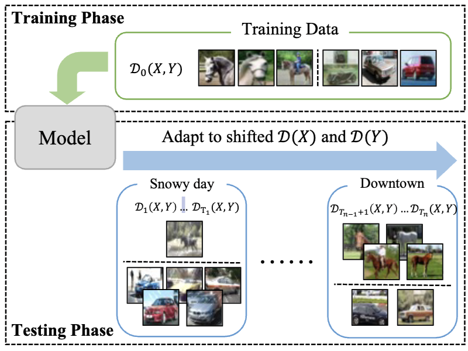
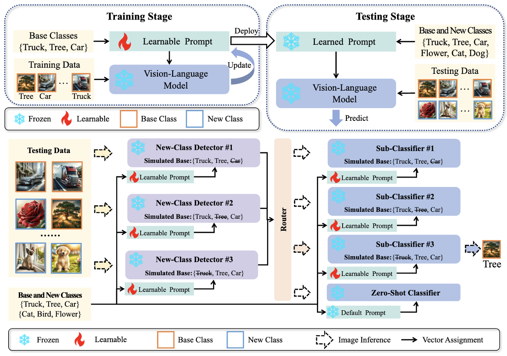
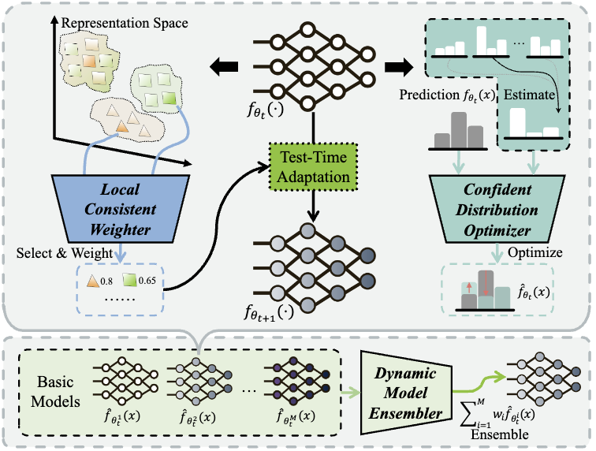
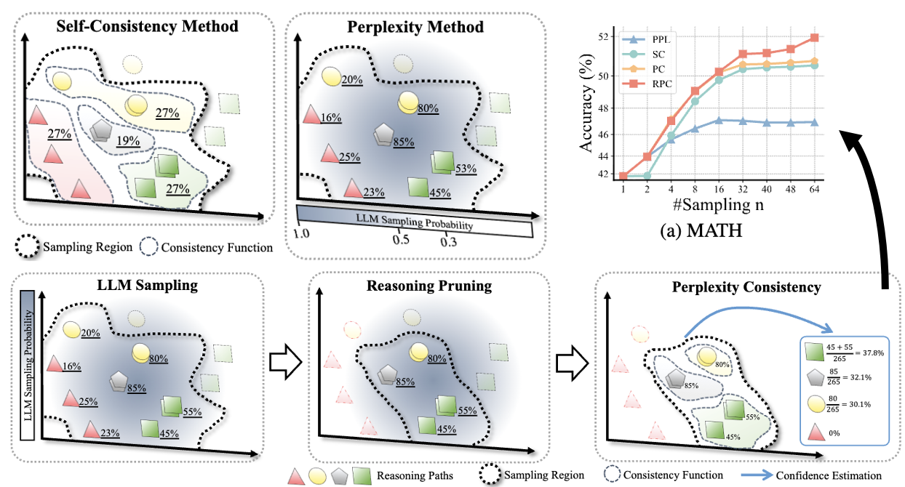
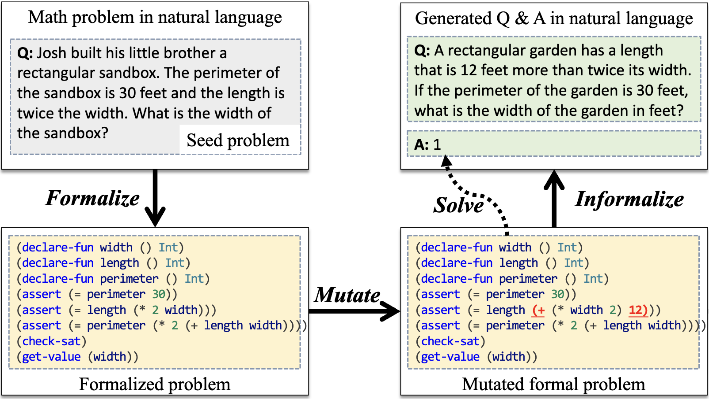








# 🤵🏻 About Me

I am a final year Ph.D. student at [the Department of Computer Science and Technology](https://cs.nju.edu.cn/main.htm) of [Nanjing University](https://www.nju.edu.cn/), advised by Professor [Yu-Feng Li (李宇峰)](https://cs.nju.edu.cn/liyf/index.htm), and a member of [LAMDA Group (机器学习与数据挖掘研究所)](https://www.lamda.nju.edu.cn/CH.MainPage.ashx), which is led by Professor [Zhi-Hua Zhou (周志华)](https://cs.nju.edu.cn/zhouzh/index.htm).

### Biography

<table style="border: none; border-collapse: collapse;">
<tr><td>2020.09 - Present</td>
<td>Ph.D. in Computer Science and Technology, <a href="https://cs.nju.edu.cn/">School of Computer Science, Nanjing University</a></td></tr>
<tr><td>2016.09 - 2020.06</td>
<td>B.Sc. in Computer Science and Technology, <a href="http://ccst.jlu.edu.cn/">Tang Aoqing Honors Program, Jilin University</a></td></tr>
<tr><td>2012.09 - 2016.06</td>
<td><a href="https://www.nsfz.net/">High School Affiliated To Nanjing Normal University</a></td></tr>
</table>

# 🎉 Recent News
- 2025.09: One paper is accepted by NeurIPS 2025 about theoretical analysis of LLM reasoning!
- 2025.08: One paper is accepted by EMNLP 2025 for oral presentation about test-time scaling of LLM reasoning!
- 2025.01: I got my first funding: National Science Foundation for PhD Students.

# 📝 Selected Works (<a href="/publications">Publication List</a>) 

* denotes the co-first authors

## 🦿 Test-Time Adaptation

ICML 2023

<b>ODS: Test-Time Adaptation in the Presence of Open-World Data Shift.</b> 
<u><b>Zhi Zhou</b></u>, Lan-Zhe Guo, Lin-Han Jia, Ding-Chu Zhang, Yu-Feng Li.  
In: Proceedings of the 40th International Conference on Machine Learning, Hawaii, 2023.  
CCF A, Oral Presentation.  
[[Paper]](https://openreview.net/forum?id=Phjti0QbkZ)
[[Code]](https://www.lamda.nju.edu.cn/code_ODS.ashx)
[[Poster]](../resources/2023/ODS-Poster.pdf)
[[Slide]](../resources/2023/ODS-Slide.pdf)
[[Video]](https://icml.cc/virtual/2023/poster/24841)
[[BibTeX]](../resources/bibtex/ICML23-ods.txt)

ICML 2024

<b>DeCoOp: Robust Prompt Tuning with Out-of-Distribution Detection.</b> 
<u><b>Zhi Zhou</b></u>, Ming Yang, Jiang-Xin Shi, Lan-Zhe Guo, Yu-Feng Li.  
In: Proceedings of the 41th International Conference on Machine Learning, Vienna, 2024.  
CCF A.  
[[Paper]](https://arxiv.org/pdf/2406.00345.pdf) 
[[Code]](https://zhouz.dev/DeCoOp)
[[Poster]](../resources/2024/DeCoOp-Poster.pdf)
[[BibTeX]](../resources/bibtex/ICML24-decoop.txt)

AAAI 2025

<b>Fully Test-time Adaptation for Tabular Data.</b> 
<u><b>Zhi Zhou*</b></u>, Kun-Yang Yu*, Lan-Zhe Guo, Yu-Feng Li.  
In: Proceedings of the 39th AAAI conference on Artificial Intelligence, Philadelphia, 2025.  
CCF A.  
[[Paper]](https://arxiv.org/abs/2412.10871) 
[[Project]](https://zhouz.dev/FTTA)
[[Poster]](../resources/2025/FTTA-Poster.pdf)
[[BibTeX]](../resources/bibtex/AAAI25-ftta.txt)

## 🤖 Test-Time Scaling

NeurIPS 2025

<b>A Theoretical Study on Bridging Internal Probability and Self-Consistency for LLM Reasoning.</b> 
<u><b>Zhi Zhou</b></u>, Yuhao Tan, Zenan Li, Yuan Yao, Lan-Zhe Guo, Yu-Feng Li, Xiaoxing Ma.  
In: Advances in Neural Information Processing Systems, San Diego, 2025.  
CCF A. <a href="https://huggingface.co/papers/2510.15444">HF #1 Paper of the Day.</a>  
[[Paper]](https://arxiv.org/abs/2502.00511)
[[Project]](https://zhouz.dev/RPC)
[[Code]](https://github.com/WNJXYK/RPC/)
[[Data]](https://huggingface.co/collections/WNJXYK/mathematical-llm-reasoning-paths-68e4c4e32e3ad7fa0fcad77a)
[[Demo]](https://huggingface.co/spaces/WNJXYK/RPC)

NeurIPS 2024

<b>Neuro-Symbolic Data Generation for Math Reasoning.</b>  
Zenan Li*, <u><b>Zhi Zhou*</b></u>, Yuan Yao, Xian Zhang, Yu-Feng Li, Chun Cao, Fan Yang, Xiaoxing Ma.  
In: Advances in Neural Information Processing Systems, Vancouver, 2024.  
CCF A.  
[[Paper]](https://arxiv.org/abs/2412.04857)
[[BibTeX]](../resources/bibtex/NeurIPS24-nesy.txt)

