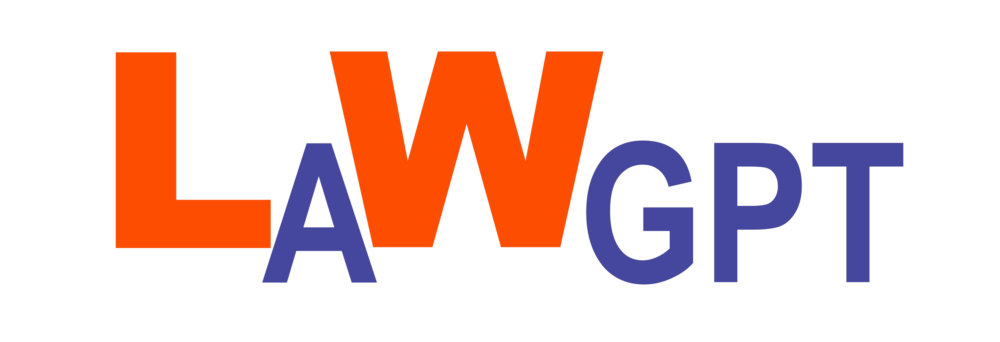
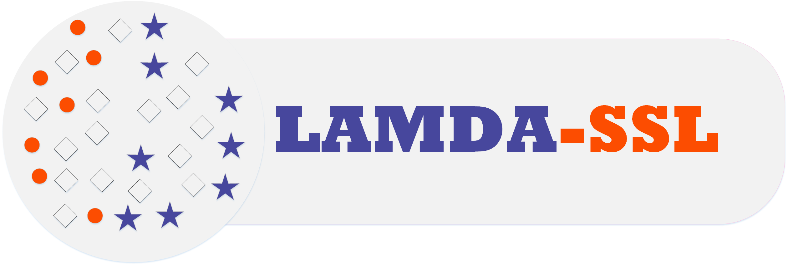

# 🛠 Software

<b>LawGPT</b> 
[[Technical Report]](https://arxiv.org/pdf/2502.06572)
[[GitHub]](https://github.com/pengxiao-song/LaWGPT)  
The first Chinese legal large language model, which is trained based on a series of open-source large language base models with massive question-answer pairs augmented using legal language models using Chinese legal documents and laws.  
🎉 6K GitHub stars!

<b>LAMDA-SSL</b>  
[[Tutorial]](https://ygzwqzd.github.io/LAMDA-SSL/#/)
[[Github]](https://github.com/YGZWQZD/LAMDA-SSL)  
A comprehensive and easy-to-use toolkit for semi-supervised learning. LAMDA-SSL contains 30+ semi-supervised learning algorithms, including both statiscal and deep semi-supervised learning. We hope this toolkit can promote the research of semi-supervised learning.  
🎉 24.8K PyPI package downloads!

# 💻 Project

- *2022.09 - 2025.09*, Judgment Knowledge Recognition Technology for Document-Level Understanding, China Judicial Big Data Institute, China.
- *2022.06 - 2023.06*, Fraud Detection System based on Weakly Supervised Learning, [Huawei](../resources/Huawei2023_Award.pdf), China.
- *2021.10 - 2022.05*, Housing Sales Customer Rating Model Optimization, [Beike (Internship)](../resources/Beike2021.pdf), China.
- *2021.03 - 2022.12*, Concept Incremental Learning with Active Anotations, Hikvision, China.
- *2020.07 - 2021.09*, Liability Judgment System based on Semi-Supervised Multi-Label Learning, Didi (Internship), China.